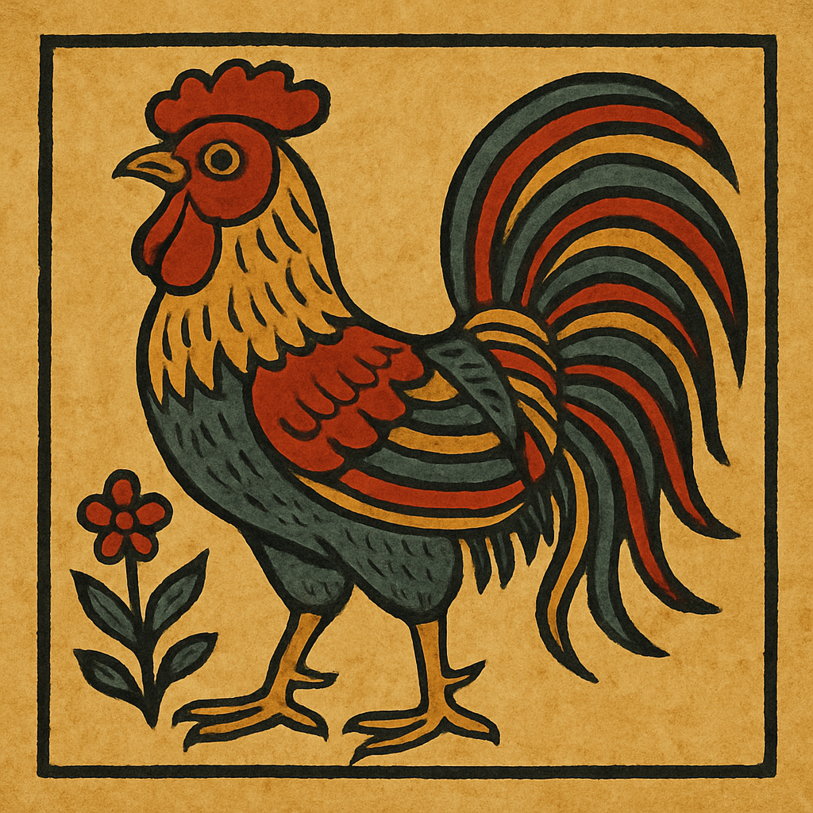

# 🎨 Xưởng Đông Hồ — Tranh Dân Gian Số Hoá

> Web app tạo tranh dân gian phong cách Đông Hồ bằng AI kết hợp editor kéo thả motif truyền thống.



## ✨ Tính năng

- **🤖 AI Tạo Tranh** — Nhập prompt tiếng Việt, AI (DeepSeek + Cloudflare Flux) tạo tranh đúng phong cách Đông Hồ
- **🧩 Editor Kéo Thả** — Thêm motif truyền thống (gà, lợn, cá chép, tố nữ...) vào canvas
- **🎨 Tùy Chỉnh Màu Sắc** — Đổi màu motif theo bảng màu Đông Hồ truyền thống
- **🖼️ Bộ Sưu Tập** — 32 tranh dân gian phân loại: linh vật, con người, thiên nhiên, phong tục
- **📱 Responsive** — Hoạt động trên desktop, tablet và mobile

## 🛠️ Tech Stack

| Công nghệ | Vai trò |
|-----------|---------|
| **Next.js 16** (Turbopack) | Frontend + API routes |
| **React 19** | UI components |
| **TypeScript** | Type safety |
| **Tailwind CSS 4** | Styling |
| **Zustand** | State management |
| **Fabric.js 7** | Canvas editing |
| **DeepSeek API** | Dịch prompt Việt → Anh |
| **Cloudflare Workers AI** (Flux.1 Schnell) | Tạo ảnh AI |
| **Vercel** | Deployment |

## 🚀 Cài Đặt

```bash
# Clone repository
git clone https://github.com/ducdung121103/xuong-dong-ho.git
cd xuong-dong-ho

# Cài dependencies
npm install

# Tạo file .env.local với API keys:
# DEEPSEEK_API_KEY="sk-..."
# CLOUDFLARE_ACCOUNT_ID="..."
# CLOUDFLARE_API_TOKEN="..."

# Chạy development server
npm run dev
```

Mở [http://localhost:3000](http://localhost:3000) để xem.

## 📁 Cấu Trúc Dự Án

```
xuong-dong-ho/
├── app/
│   ├── api/generate/    # API AI tạo ảnh
│   ├── bo-suu-tap/      # Trang bộ sưu tập 32 tranh
│   └── page.tsx         # Landing + AI Chat
├── components/
│   ├── editor/          # Canvas editor
│   └── ui/              # UI components
├── lib/
│   ├── ai-generator.ts  # DeepSeek + Cloudflare logic
│   ├── motif-data.ts    # 32 motif dữ liệu
│   └── store.ts         # Zustand store
├── public/
│   └── dong-ho/         # 32 ảnh tranh Đông Hồ
└── references/
    └── tranh-dong-ho/   # Ảnh tham khảo gốc
```

## 📝 License

Dự án phục vụ mục đích văn hóa, giáo dục. Tranh Đông Hồ là di sản văn hóa phi vật thể của Việt Nam.